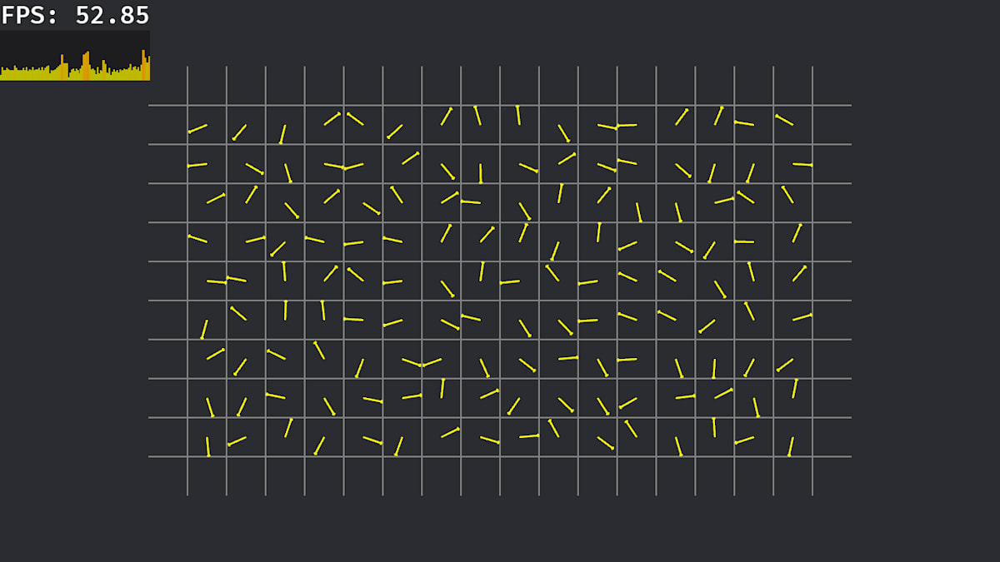

# wgpu minimal example on Bevy

This repository provides a minimal example of integrating wgpu compute shaders within the Bevy engine.

The compute shader logic is decoupled into a separate crate from the Bevy-specific code. Bevy’s responsibility is limited to initializing the wgpu instance, submitting tasks to the command queue, and handling the final rendering.

This architecture allows you to iterate on your compute shaders without being hindered by Bevy's long compilation times.

For further details, please refer to the article on Zenn (written in Japanese).
https://zenn.dev/pneumo/articles/20251213-wgpu-minimal-example-on-bevy



## Run

```sh
$ cargo run --features=bevy/dynamic_linking
```

for WSL2,

```sh
$ WGPU_BACKEND=vulkan cargo run --features=bevy/dynamic_linking
```

## Compute shader

This sample demonstrates the rotation of $N$ 2D vectors $v_i = [x_i, y_i]^T ~~~(i = 1, \cdots, N)$ by an angle $\theta$.

$$
v_i(k+1) = R(\theta) v_i(k) \\
R(\theta) = \left[ \begin{array}{cc}
\cos(\theta) & -\sin(\theta) \\
\sin(\theta) & \cos(\theta)
\end{array} \right]
$$
